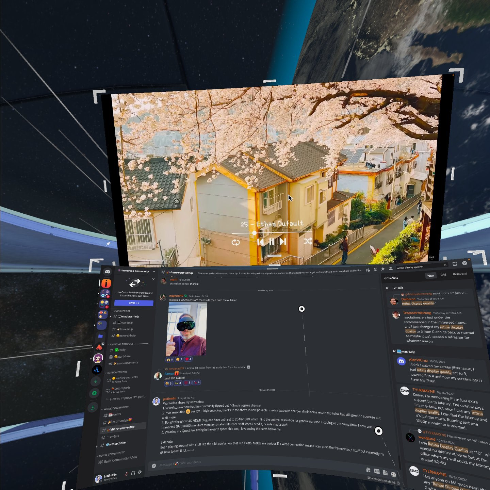
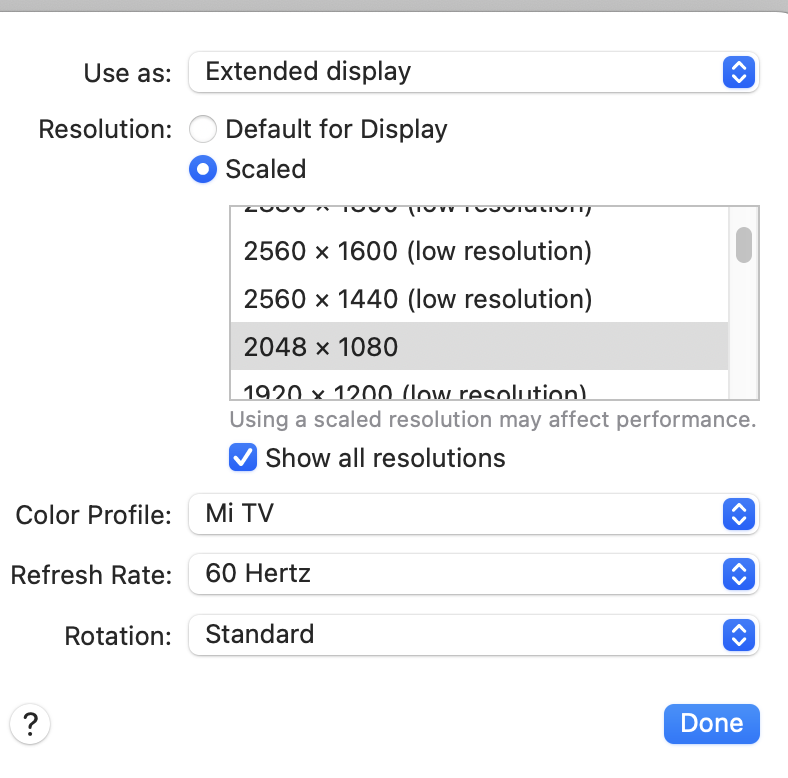
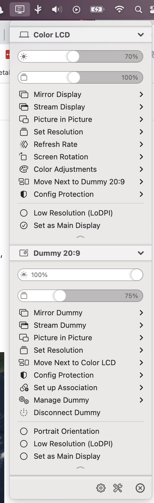
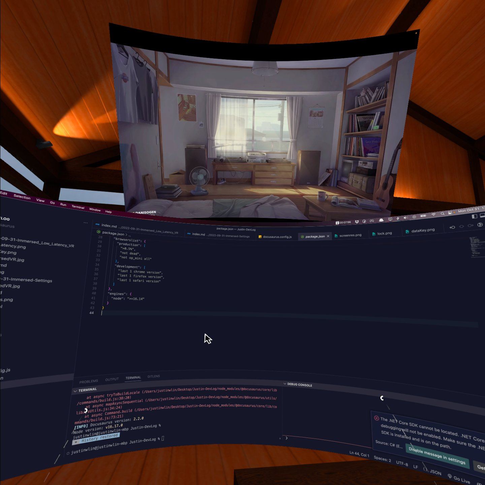
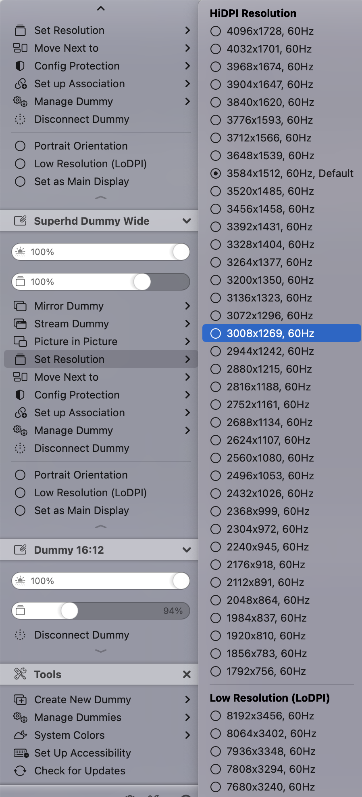
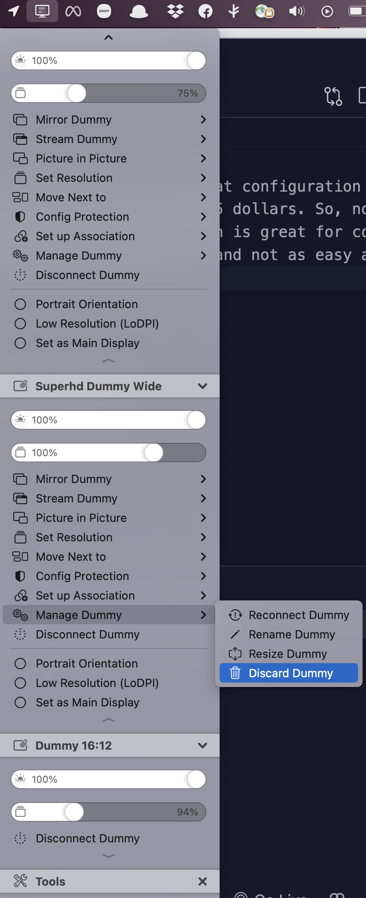
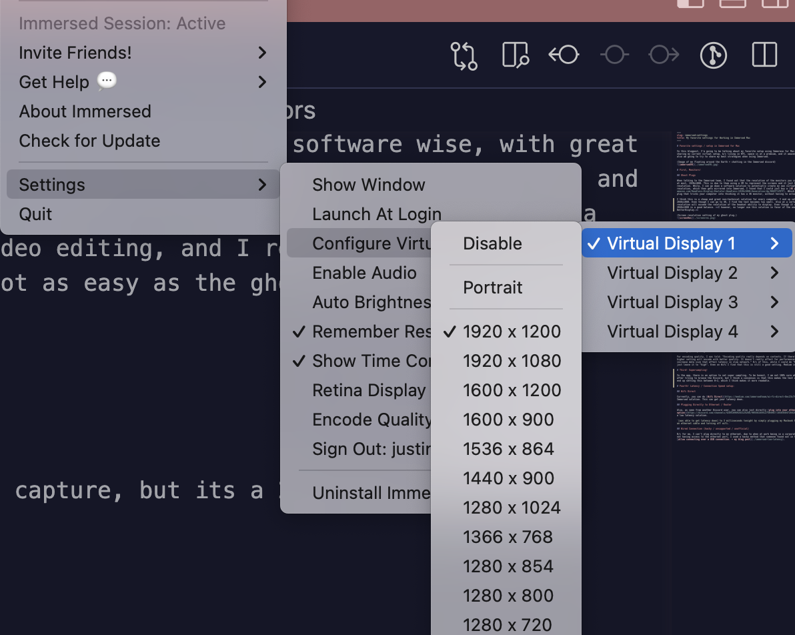

# Favorite settings / setup in Immersed for Mac

In this blogpost, I'm going to be talking about my favorite setup using Immerese for Mac. B/c yes, I just love sharing my current virtual setup, b/c living in NYC, space is at a premium, and it amazes me of the future! I also am going to try to share my best strategies when using Immersed.

(Image of me floating around the Earth + chatting in the Immersed discord)

# High Level Settings Overview

**Immersed Settings:**
Super-sampling: 0-2

Monitors: 2K resolution range, above 2048x1080, I think is best.

Retina quality: 0-2

Encode Quality: Medium/High

Virtual mouse: on

**Additional Software:**

BetterDisplay for virtual monitors

Alfred 4/5 for productivity shortcuts

# First, Monitors!

(Which I think is a big part to the clarity of the Immersed setup.)

## Ghost Plugs

When talking to the Immersed team, I found out that the resolution of the monitors you can spawn in Immeresed is at most, 1920x1080. This is due to them using a VM to represent the screens and it just has a cap to the resolution. While, I can go down a software solution to potentially create my own virtual monitors at a higher resolution, which then gets mirrored into Immersed, I found that I could just buy a [4K ghost plug](https://www.amazon.com/Headless-Display-Emulator-Headless-1920x1080-Generation/dp/B06XT1Z9TF). Which is essentially an HDMI plug that tricks your computer into thinking it has a 4K monitor, without having to actually display the image.

I think this is a cheap and great non-technical solution for every computer. I end up setting these displays to 2048x1080. Even though I can go to 4K, I find the text becomes too small. Also at a certain point, the resolution will exceed the resolution of the headset ability to display, and pass 2K the differences become minimal. Even though it can get sharper, I think 2048x1080 is a great place to be, for sharpness + clarity + text size. **I however, no longer use this solution in favor of the one upcoming: BetterDisplay.**

(Screen resolution setting of my ghost plug.)

## BetterDisplay (Mac Only)

I recently found out about this solution on Mac, which lets you create dummy monitors software wise, with great configuration options from the Immersed discord. It allows you to create a dummy monitor of any resolution, and a license is only 15 dollars. So, now, instead of my 4K monitor ghostplug, I can create fake monitors in software at any ratios, for me I like a 20:9 ratio, at 2K again. The con to this is that there is additional software configuration, and not as easy as the ghostplug, but both are great options.

I still find that the best resolution range is in the 2K range.

(Better Display settings > Manage Dummy > Resize Dummy)

(Better Display WideScreen) (The image is distorted due to Oculus capture, but its a 20:9 monitor)

(The ranges of resolution options for Dummy Monitors)

(There is a resize option that lets you set the aspect ratio, which I set to 20:9 / other configurations depending on my work)

## Immersed Virtual Monitors

The immersed virtual monitors, I find is usually set to a lower 1400x900 when it spawns. You should set this to the max of 1920x1080 if you chose to use them. Otherwise, I find that text is too blurry.

## Overall feeling:

1920x1080, I feel is the minimum for a good quality monitor. But if possible I think that 2048x1080 / any monitors in the 2K range, to be the best resolution to work in, especially if you have alternative solutions outside of the Immersed built in additional monitors. Past 2K I find that the return is minimal.

It becomes better to focus on monitor configurations + display sizes and ratios, to get the best experience.

## Note:

In the Menu > Settings > Monitors, there is a sidebar, look closely, use your controller to drag the scroll bar down. It **does not** work based off of joystick. You can save different monitor configurations! I find this helpful as I might have one monitor configuration with my wide screen in the middle + my normal macscreen on the side.

While I have another configuration with it in the background + my mac screen in the middle. I find this helpful for different workflows.

# Second! Retina and Encoding Quality:

## Retina Quality

Retina Quality: 0 - 5

When talking to the Immersed team, I asked them what is retina quality in the Immersed computer app setting. I was told that: "if your original resolution is 1920x1080, then 0 will render as 1920x1080 pixel and 10 will render as 3840x2160 for retina display."

Meaning that it basically doubles the amount of pixels that Immersed tries to bring into the headset. But due to the diminishing return, the sharpness increase after 5 is not much. In addition, with every step up, there is a **large latency hit**, meaning that it is better to set the base monitor at a higher resolution in the 2K range, and keep the retina quality closer to 0-5, to reduce latency.

Again, past 2K resolution, there is not much of a difference showing up in the headset for me, so better to optimize for latency past that point.

## Encoding Quality

Encoding Quality: Medium - High.

For encoding quality, I was told: "Encoding quality really depends on contents. If there's lots of movement, higher setting will encode with better quality. It doesn't really affect for performance-wise, but it will increase data size that affect latency in slow network." B/c of this, while I could do "highest", I decided to just leave it between "medium" and "high", and I think this is good.

# Third! Supersampling!

In the app, there is an option to set super sampling. To be honest, I am not 100% sure what this does, even after trying to browse the Discord, but I think a consensus is that this makes the text worst? So, I actually end up setting this between 0-2, which I think makes it more readable.

# Fourth! Virtual mouse on.

Keeping virtual mouse on will heavily reduce input latency.

# Fifth! Latency / Connection Speed setup:

(This section is if you are just chasing after the best low-latency possible, but might take a lot of playing around. Hopefully the above sections are enough.)

## Wifi Direct

Currently, you can do [Wifi Direct](https://medium.com/immersedteam/wi-fi-direct-8ec23c74fdab), an official Immersed solution. This can get your latency down.

## Plugging Directly to Ethernet / Router

Also, as seen from another Discord user, you can also just directly [plug into your ethernet if that is an option](https://discord.com/channels/428916969283125268/905561659127504967/1036458472641937519). Which is quite a low latency solution.

`[was able to get latency down] to 3 milliseconds tonight by simply plugging my Macbook Pro into my router with an ethernet cable and turning off wifi.`

## Wired Connection (hacky / unsupported / unofficial)

:::caution

After further investigation,there is caveats to this solution, and is not a full wired solution, and only seems to be transmitting the initial connection (for more stable connection to computer) + input latency time.

**I do not necessarily recommend this solution** unless you want to chase down reducing input latency time + bit more technical, and you've tried the other settings and configurations already, and maybe play around a bit more yourself too.

:::

B/c for me, I can't plug directly to my ethernet, due to when at work being in a corporate network, or at home, not having access to the ethernet port, I used a hacky method that someone found out in the DIscord community to [allow connecting over a USB connection. - my blog post](../2022-09-31-Immersed_Low_Latency_VR/index.md).
