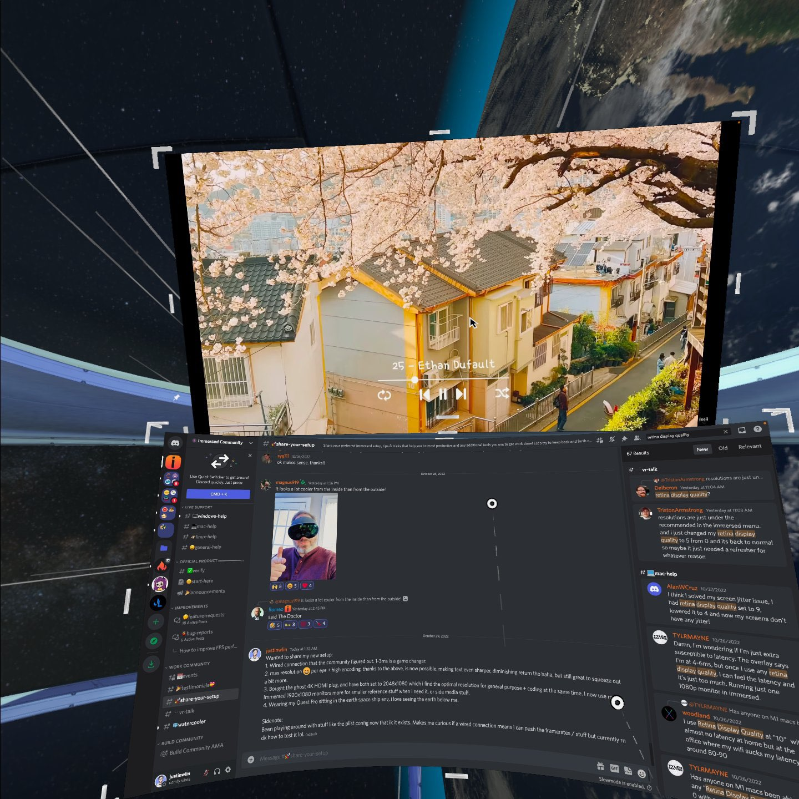
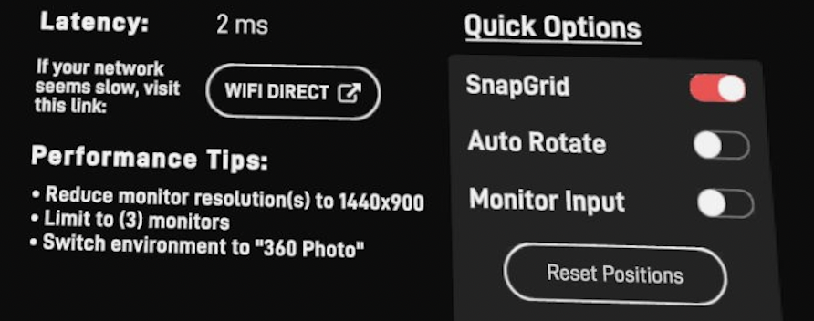
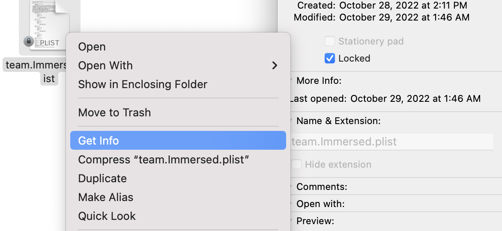

:::caution

After further investigation this wired method is **NOT** as good as expected. It does not stream display over the wire.

As context, first lets talk about how the computer and headset talks to each other. The first is that the computer and headset goes and talks to a middle-man server. This middle-man server gets both computers to agree how to communicate directly to each other. They then connect. The computer is streaming its display to the oculus headset.

A big problem in latency for me was the time it took for me to move my real mouse to interact with my computer. There was a significant lag. As proof, when I spun my mouse in a circle, I would get latency that spike up to 50ms to 80ms. Where I then moved to a virtual mouse, and then there was still some lag. This wired method, basically only optimizes your this "virtual mouse". As the position of your virtual mouse in the oculus display, is sent straight to your computer.

Thus, I'd only recommend it if this is a bottleneck for you + if connecting to your computer and establishing an initial connection is a problem.

How to test, play a Youtube video. If the youtube video is playing at an okay speed for you, then streaming your computer display to your headset is not the bottleneck. If it is lagging for you significantly, this wired method will **NOT** help you.

If moving your virtual mouse / real mouse is lagging, and is hurting your workflow on where you are pointing / interacting with your computer, then this guide might help you create a more real time workflow.

Feel free to [read this Discord message for more information as to the discovery that the wired connection 1ms response time is not as expected](https://discord.com/channels/428916969283125268/930540280380268564/1037099670343782450)

:::

# Immersed

Recently, I've begun to work in VR, using an app called Immersed. And I have to say it is one of the most gorgeous thing ever. With very limited space, I am now able to work with as many monitors as I want, and have flexibility that I've never had before.

(Image of me floating around the Earth + chatting in the Immersed discord)


## What is the existing problem?

One of the big problems with Immersed when I first worked with it for several days was the latency + restriction to be on the same wifi network. (Not that it is their fault). Currently, all virtual workspace apps have a restriction to have to stream the display over the same wifi connection. This causes latency of 20ms-50ms depending on your wifi, and on some networks like corporate network this is not always viable.

The solution would be to use a wired connection, but unfortunately, there is no official SDK from Meta's side (to my knowledge) to allow this type of data streaming connection, and thus, why all solutions, even Meta's own Workplace Horizon app, is limited to wifi. Maybe as more investigations is done over time, there will be new official options that emerge in the future.

# Existing Solutions / Supported

Currently you can use [Wifi Direct](https://medium.com/immersedteam/wi-fi-direct-8ec23c74fdab), an official Immersed solution. Or also, as seen from another Discord user, you can also just directly [plug into your ethernet if that is an option](https://discord.com/channels/428916969283125268/905561659127504967/1036458472641937519) `[was able to get latency down] to 3 milliseconds tonight by simply plugging my Macbook Pro into my router with an ethernet cable and turning off wifi.`

## Credit + Solution

As I interacted in the Immersed community, someone in it by Discord name, @OwariDa, figured out how to get a **wired connection working**! His [blog post](https://clevcode.org/low-latency-vr-desktop-with-immersed/). His tutorial is great and has instructions for Window / Mac / Linux, but I just want to write a bit more organized about the Mac side of it and my own finding + following another [Discord user's instructions README in the Discord server](https://discord.com/channels/428916969283125268/930540280380268564/1035372771569574038), @woodland, who was able to build ontop of OwariDa post. Please highly recommend, also refer to these other instructions if needbe.

But what I hope with this post is to build ontop of their instructions, maybe make it a tadbit easier to follow for mac, and add some of my own findings.

Benefits of a wired solution:

- Should work on a corporate network (though have not yet tried)
- Latency is very low
- Stable connection to the laptop
- Flexible to bring around to other wifi avaliable spots.

Con:

- A lot of setup is needed / not as easy as just plugging into a router / wifi direct if an option.
- Tethered to your computer

:::note

This approach is a hacky approach, not "officially" supported by the Immeresed team. So while the Immersed team can be helpful, they are not responsible nor can provide official support for this. Probably community support for those who are doing this currently is best.

:::

## End Results

By the end of it, the goal should be to use a wired connection to Immersed, and have a latency of 1m-5ms latency. This is a huge improvement over the 20ms-50ms that you get with wifi.


## Devices this blog is targeted at:

Quest 2, Quest Pro, and Mac OS. Though Owarida blog post, goes over Pico4, and again, the other operating systems. I still hope maybe this article, can help give additional context to this process to those trying to get it working.

## Notable Alternative

[Gnirehtet](https://github.com/Genymobile/gnirehtet) project. As stated in owarida blog post, there is a different project that is able to establish a connection between your headset and computer. I'm guessing if you use this project, the only additional modification you would need to make is to change the desktop application to look at the local network (which will be part of the blog post) down below. But I couldn't get this to work personally.

# How to get a wired connection working

Note, I highly recommend read this whole article first, as there are some gotchas! And I want you to be aware of it before following fully along.

## Definitions

Agent - the Immersed Desktop application

Client - your headset

## Prerequisites

1. You must enable developer mode and enable USB debugging. For Quest devices, the steps are [here](https://developer.oculus.com/documentation/native/android/mobile-device-setup/) Make sure that after you get a developer account, you also set your headset to developer mode.

2. [Install ADB - Guide how to do it](https://www.xda-developers.com/install-adb-windows-macos-linux/)

Additional Oculus Documentation if need-be:

[mobile device setup](https://developer.oculus.com/documentation/native/android/mobile-device-setup/)
[adb](https://developer.oculus.com/documentation/native/android/mobile-adb/)

:::note

Run `adb devices` with your headset plugged in. If your device does not show up, there is still an issue, and you won't be able to run an adb command later in the guide.

:::

3. You might need a modified agent from the Immersed Discord community. Depending when you read this, this modified agent, might have already been released, when talking to the devs / Immersed community, but we will get into this later. Definitely check the Discord first, or if it been a while since this post has been written, it should have been released, and maybe even an official alternative to this method.

Edit: Seems like the beta-agent is public on the [Discord as a message, so I'll put the link here if interested](https://discord.com/channels/428916969283125268/930540280380268564/1036607596385284146)

## Context

What are we about to do? (Note, this is from my own understanding and may not be technically correct.) But should still give you an idea.

When the client is booted up, it broadcasts packets on your wifi network. If these packets are received by the agent, then the agent will connect to the client. These packets are sent over WIFI / UDP connection. So what we need to do instead is, establish a TCP / wired connection to our computer. And then, when we click on connect to a computer, have it send these packets or request over the wire, and have the agent, respond back to the client over the wire vs trying to stream it back out over wifi. This is the gist of it. (BTW, IK that UDP/TCP are just protocols for communication and not necessarily wired/nonwired connection, just saying that these are the protocols being used in these instances since there is some important differentiation here).

## Instructions

## First goal: Force the agent to look for connections only on the computer.

The first step is to force the agent to look for connections only on the computer, or essentially only on your localhost. Immersed has a config file, where we can forceIPAddress, to tell the agent to only look for connections on the computer.

### Step 1:

Quit both the agent and the client.

### Step 2:

Using xCode, or software that would let you modify plist files, go to:
~/Library/Preferences/team.Immersed.plist

Do not use a direct text editor as it is unable to properly write the plist file.

### Step 3:

Identify the data key of the file:


Ex of the data key for me (though I have played around with some values / redacted my client key here):

```
{"Analytics":"[]","Capture":"{\"EnableAppFrames\":\"1\",\"FPS\":\"80.000000\",\"FPSFor2\":\"80.000000\",\"FPSFor4\":\"45.000000\",\"SavedFrames\":[{\"Height\":\"900\",\"Index\":\"VD-2\",\"RefreshRate\":\"120.000000\",\"Width\":\"1440\",\"X\":\"4288\",\"Y\":\"76\"},{\"Height\":\"1200\",\"Index\":\"VD-0\",\"RefreshRate\":\"120.000000\",\"Width\":\"1920\",\"X\":\"808\",\"Y\":\"1117\"},{\"Height\":\"1117\",\"Index\":\"MainDisplay\",\"RefreshRate\":\"120.000000\",\"Width\":\"1728\",\"X\":\"0\",\"Y\":\"0\"},{\"Height\":\"1200\",\"Index\":\"VD-1\",\"RefreshRate\":\"120.000000\",\"Width\":\"1920\",\"X\":\"1728\",\"Y\":\"-83\"}]}","Client": [REDACTED],"EnableAudio":"0","Encode":{"Codec":"3","Encoder":"Auto","ForceBitrate":"0","GPU":{"LocalCaptureFPS":"60.000000","LocalMaxBitrate":"16000.000000","LocalMinBitrate":"4000.000000","RemoteCaptureFPS":"60.000000","RemoteMaxBitrate":"8000.000000","RemoteMinBitrate":"1000.000000"},"Quality":"0.700000"},"ForceIPAddress":"127.0.0.1","ForcePort":"0","ForceStreamPort":"0","Log":"{\"CurrentSuccessCount\":\"6\",\"EnableForceLog\":\"0\"}","SettingVersion":"1","WebRTC":"{}"}
```

## Step 4:

Find the `"ForceIPAddress"` which should be of the value: `“ForceIPAddress”: “”` and change it to `"ForceIPAddress":"127.0.0.1"`

There is some caution I want to make here. Make sure that the quotes are in the proper place. The first time I did this, they were not. Second, you might need to retype the quotes. When I originally did this, I copied from owarida blogpost, where the quotes look like `”` but I needed to manually type the quotes out so that they looked like `"`. If you type it with your own keyboard on the quotes, should be correct.

## Step 5:

Lock the file. In order to do this, find the file in finder. You can type in the terminal `open ~/Library/Preferences/` and use the search bar to search in the preferences folder for the team.Immersed.plist file. Then right click on the file and select "Get Info". Then check the box that says "Locked".


## Second Goal [Optional depending on the time of reading this]

This is the most important step!!! When you are reading this, there are two alternatives to go down.

1. Using a modified beta-agent that the Immersed Discord Team was able to provide me. Maybe this is something can ask, if can be provided to you if you chose to go down this route, or maybe it has already been released. As the mods / devs, were saying they hope to get a release soon (who knows when) to this modified agent.

But the current problem is that the current publicly released agent, even when we set the forcedIPAddress to localhost, it will still try to look for connections over wifi. So the modified agent by the Immersed team, when the forcedIPAddress is set, will not look for wifi connections, thus meaning, we can force it to only look for wired connections. So I first, highly recommend, maybe wait for a release of this modified agent, or maybe the Immersed team will be kind enough to provide it.

:::tip

Update: Has been posted in the Discord as a public message, [so I am more comfortable to share here, this is the Discord message link](https://discord.com/channels/428916969283125268/930540280380268564/1036607596385284146)
**Highly recommend** using this modified agent and skipping the Section 2, and going to Section 3.
:::

2. If the agent has not been released, and you want to try to do it with the publicly avaliable agent, then we can just block all UDP packets that are being streamed over the network to our computer. Thus, if the agent is unable to find this packet, will use the localhost connection (wired connection).

### Second Goal: Blocking all UDP packets (Optional Step if not the updated / modified agent)

BTW, this is a step that is only possible if you own the computer. I was trying to do this on my company computer, and I am for obvious reasons not allowed to modify the network configuration, so I used the modified client instead. Also, I found difficulties in getting this to work for my personal computer, so I ended up skipping this step, and was provided a modified agent through a beta-link by the Immersed team. But, this is still how I tried to do it following owarida's blogpost and woodland instructions.

B/c the agent is still going to be looking for UDP packets, we want to block all UDP packets coming onto the network coming towards our computer.

1. Open Terminal.app and run the command: `ifconfig`
2. Look for the en0 interface and copy the "broadcast" address from the command

For me, I was able to cmd + f for broadcast flag and found the following parts a bit under the en0 section
(parts of the number I replaced with xxx)

```
 netmask 0xffffff00 broadcast xxx.xxx.0.255
```

3. Copy that number: `xxx.xxx.0.255` (whatever the number is for you)
4. Open the following in a text editor `/etc/pf.conf`
5. Add two line breaks after `load anchor "com.apple" from "/etc/pf.anchors/com.apple"`
6. Type: `block drop in proto udp from any to <BROADCAST ADDRESS YOU GOT>`. Owardi command is a bit different, but both works, if you are following along with his instructions too. But feel free to use this command, or Owardi's blog post command. Woodland used this command above.
7. Save the file, you might need to use sudo to save it / type in your computer password.
8. Type in the command `sudo pfctl -e` to enable pf
9. Type in the command `sudo pfctl -f /etc/pf.conf` to load the config we edited in pf.conf
   (If you ever want to delete this configuration in the future: just remove the line and run step 8 and 9 again).

## Third Step: Opening a connection between the headset and the computer

Plug in your headset, allow in the headset for the computer to be able to talk to your headset if asked.

Then run using your ADB command:
`adb reverse tcp:21000 tcp:21000 && adb reverse --list`

If you have your adb in a different file path, make sure to specify / cd to wherever it is. This is now opening a connection between our headset and computer. you need to do this every time you plug in your headset. I actually have a tool like Alfred4, which makes it easy for me to set up keybinds for things like this, but you can do it manually too.

You should see the result:
`UsbFfs tcp:21000 tcp:21000`

## Fourth Step: Run the Immersed Client

Go to the Immersive client, and run it. Sit at the choose computer screen.

## Fifth step: Run the Immersed Agent.

1. As it starts up, double check your plist, still has the forcedIPAddress set.
   (BTW, by locking this file, some of your preferences when using Immmersed might not be saved for next session, if you ever find a bug like that).

2. Then, as the agent starts up, should say ready to connect, BUT, it should not automatically connect.

3. If it automatically connects, something is wrong, and it is still picking up the UDP packets over wifi, if you got this far, and are not using the modified client, you might need to request it from the server.

4. Now, on the client, click on the computer you want to connect to, and now it should connect to the agent.
5. You might see latency saying it is 1-10ms, but should settle down between 1-5ms after.
6. If you unplug the cable, the connection should crash, this is also a way to verify if it is working.

## Running this in the future:

In the future, the only requisite is that you need to open the reverse connection with the adb command > then open the Immersed agent. From there, you can open the app before or after opening the agent, and click to connect to the computer.

B/c the goal is as always:

1. Establish the wire connection, which locally connects your computer to headset
2. Tell the computer to look only locally on that computer for that wired connection.
3. As long as that is established, you can open your agent and client in any order.

# Additional Configurations you can make now:

Check out my other post in [this link](./immersed-settings)
