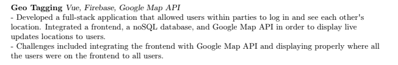

# Writing Resume + Tips!

## Summary

Resumes tend to be the hardest for people who are inexperienced. If your resume has two columns, graphics, pictures, lots of white spaces, not standard template, it is probably bad. If it has too much jargon, where people do not know what it means, or only impact driven with numbers without an explanation of what you did and the challenges, it isn’t good enough.

The content should be 1 page, digestible, and the most important things.s

## ATS System

Larger companies use something called ATS, which is a resume parser, and this is why I recommend doing standard formatting, or a single-column resume.

[\*\*How to get a job in tech (Gautama)](https://www.notion.so/Resources-768b5e97d6b84ac690c43c348801dfb4?pvs=21) part 1, speaks more in-depth about this.\*\*

## **Grain of Salt**

However, over the years, working at FAANG, and teaching multiple people, I do not think this is something to over-worry about, or think that my resume needs to be 100% algorithmically perfect. Someone at the end of the day does read it, and I’ve seen not as good resumes get through screening.

But, by being aware of an ATS system, which asks to use a standard resume, is that it makes it also makes it easier on everyone to: read, understand, and scan.

Resume Templates:
[Refer to my resources](/guide/Resources/)

## Common Mistakes

1. You write something "soft" such as: "I worked with three other developers in order to create stretch goals, and we accomplished them." "Showed my proficiency in React by making XYZ site".

   - The reason why I call this soft is b/c I could essentially say "I am the greatest programmer in the world" but none of it matters without qualifying statement. Don't tell me that you know React, or that you worked with other "humans" that is sort-of a given. Tell me the challenges you went through.

2. Be more detailed!!!

   - This will be talked about further in the "Bullet points section of your Resume", but I see a lot of people write something like: "I worked on a project that was a social media site, and I used React, Node, and MongoDB". And that literally is it. A single bulletpoint. You can definitely expand more on, challenges, what your project is about, etc.
   - You need to imagine for a "student" or entry level job, they are looking for technical proficiency. So thus, flex that you aren't useless.
   - For an industry hire, the higher your level, you don't need to describe so much of a "CRUD" app building process, but you should still be detailed in how you moved the needle. Like, if you managed 5 engineers, how did you do it, what was the goal, impact, so on. Or, if you did work on something impressive, go and flex it if it is not under NDA!

3. Don't use insane Jargon
   - If your company uses the "SpaceX TurboModule3000x" don't write that. Just say, worked with a custom file transfer protocol that the company developed, and added xyz features.
   - Especially for PHDs, while you can definitely flex your publication in the publication section so on, do try to keep your resume readable.

## Bullet points of your Resume

---

Make sure your bullet points are well written, here is a great [article](https://www.notion.so/Resources-a0859f3cde9d425488b807d95b5d068b?pvs=21) covering that, read this article to know how to write a good bullet point.

I also personally recommend some people to follow the format of what you developed and challenge as a very simplified bullet point if you cannot come up with one that follows the above structure. This is just a VERY simplified structure for those who are unable to come up with something more complex. But the nice thing is you can get something that looks more fleshed out and detailed.

Ultimately, feel free to **use whatever template** as long as it's clean, structured, easily readable. I just used a standard resume template I found in Pages and modified it to my liking

## What you did Challenge Format:

**(This is more for beginners / projects / and a start. I find this is helpful to those who don’t know what to write about but I do recommend following the article or using the deconstructive writing style later on).**

For example, this is a resume snippet that I helped one of my mentees develop and we followed a what she developed and challenge format following a Vue course that I told her to do; follows a format of: what did you do, and what were the challenges



**Some other tips, in terms of bullet-points:**

- Do not write!!! I worked at a company with a 1 million dollar assets. I organized….
  Write it neatly and concisely on **WHAT YOU DID, not what the company was or boring things like, I can use Microsoft word .\_.**
  People can tell you are desperate at that point.

### Example Bulletpoint from my Resume

Not saying the below is "perfect" by any means - at a certain point became bit lazy to make it less obtuse and I could have increased clarity - but the goal I think is I demonstrated to at least show-off that I know what I'm doing.

```

SDE Intern | Amazon | May 2020 - August 2020
• Worked on features for noSQL workbench, a desktop application to work with AWS database services, mainly
DynamoDB.
• Implemented features such as: importing templates from other AWS services, bulk importing and exporting data,
and supporting CRUD operations for DynamoDB tables. In addition, also supported other complex interactions
such as globally scaling up scaling down tables by combining other API services from AWS.
• Worked on Java SDK1 to SDK2 migration for DynamoDB Local, and restablished deprecated pipelines such as DynamoDB Lockclient, an arbitrary data-locking library to help unblock use-cases for enterprise customers.
• Technology: Vue, Typescript, Java, Electron, Jest, Webpack, Babel, Figma, Adobe XD,
```

## Deconstructive Writing:

Another way of writing is to deconstruct this more in-depth, following the article that I linked let's try it with this example:

> **I worked on a react project to design a dashboard.**

Can be improved by writing (following a bit in inspiration to 22 by 2, the article I linked at the beginning of this section)...What did you do, why did you do it, if there are metrics you can qualify or quantitate it, or give it substance that you know what you are talking about.

**What did I do**: I designed a React UI dashboard

**Why did I do it**: To parse incoming data stream that I had coming from customer data

**What did I do**: I used React and live visualization modules to display it in a more intuitive manner, and had challenges such as implementing file parsing.

**Example reworked:**

I developed a React UI dashboard that helped visualize datasets from our customers from our backend endpoints. Used modules such as D3js to manipulate graphics dynamically, and also dealt with additional challenges such as file parsing data from the client's computer to then visualize and persist in the backend database.

**Here is [my own resume](https://www.notion.so/My-Resume-cec5e438d8594d4fab10f4f91da6e27a?pvs=21) - this is old.**

You will notice in my own resume, I like to add an additional bullet point at the end of every experience stating:

**Technology:** React, Redux, etc etc…

Also my resume is for sure not the best - I did not really at the time fully deconstruct everything I did to a perfect degree, but I tried to get across back then what I did. And that is something to note though. Once your resume is good enough - there is a lower ROI. So don’t minute over every detail.

I also recommend focus on WHAT YOU DID. I see often people write, “I increased our efficiency by 100x”. (Also people have no relative measure for what this means). But the problem isn’t really just knowing your impact, but how did you get there, bc companies are hiring for technical skillset. So this is why the deconstructive writing is good bc it helps you focus on WHAT you did too.

## Declining ROI (return of investment)

Personally, I believe at some point a resume has a declining ROI. It is not the end all be-all, rather it’s just a creak in the door. So as long as you can get it good-enough, I think you are solid. Even my own resume, I stopped overemphasizing on every detail, because at a certain point I decided it was better spent studying for my interviews and actual technical knowledge.

## Don't have enough stuff to talk about on your resume?

---

What happens if you don’t have enough things to put on your resume? **Do projects**!!!! I have talked to freshmen and sophomores with nothing on their resume, and all I do is tell them to take a Udemy course and to just follow along with the projects and then bam, instantly 3 to 5 projects to instantly put on your resume. (Now not like you have "mastered anything" and I encourage to keep learning and pushing yourself, but these are great starting points to begin to know what you didn't know before.)

If links are broken try this resources page:

[Resources](https://www.notion.so/Resources-a0859f3cde9d425488b807d95b5d068b?pvs=21)

Some recommendations:

1. [Python Developer](https://www.udemy.com/course/complete-python-developer-zero-to-mastery/)
   - Scripting with the Python section under this course is a great place to just instantly gain 4 projects in 3 hours that you can immediately put on your project.
   - Specifically here are some ways that I think you could sell some of the projects on the scripting course. The idea is ultimately just to think of any sort of application, ex. emailing and SMS automation can be used for a lot, web scraping can be used for a lot, mass pdf correction and watermarking can be used for a lot, figure out how to make your project interesting, and discuss the technical aspects that went into it:
     - Created an automated emailing and SMS system in order to automatically process club events and do system-wide announcements to club members within certain groups about events. Difficulties included XYZ
     - Created a web scraper in order to scrape through school classes and help generate a list of possible classes to take. Difficulties included... XYZ
2. [Build Web Page](https://www.udemy.com/course/build-web-apps-with-vuejs-firebase/)
   - Also another great course with 3 full-stack web apps, all written in Vue, and very easy to learn quickly. You probably won’t know what you are doing completely but a good dive into Vue and you can go deeper into it through other Vue courses but this one you come out with three solid projects to start with. I recommend Vue bc a lower learning curve than React, much lower.
3. I ALSO HIGHLY RECOMMEND [ZERO TO MASTERY ACADEMY](https://academy.zerotomastery.io/?affcode=441520_f6or6wqt) :
   1. I am a mentor in it! But it is one of the best places I think where the academy monthly pricing gives a lot of access to the Python Developer course, React Developer course, a Mastering the Coding interview course, and a Big Tech Coding interview course so it definitely is more cost-effective I feel in terms of resources and very high quality!
4. My personal path: I learned from the Complete Web Developer Course:
   - [Udemy Web Developer course](https://www.udemy.com/course/the-complete-web-developer-zero-to-mastery/)
   - Which if you want to go down the React route versus Vue, I think is an amazing course and where I first got started. But this course is very large and thorough and isn’t maybe as short-term as the other courses above if you are just looking to build a resume. This is more for a foundation as a developer, and less so for interviewing short-term. You build a full-stack web app from scratch, learn React and Nodejs and Postgresql and make a face detection website.
   - You can go through this course first to learn fundamentals before diving into a framework your choices like continuing down React or Vue.

**Note: While most the above are all hacky ways to fill your resume, I do think at some point, do try to pick a specialty. I recommend learning Frontend or full-stack development, as linked in my recommended timeline.**
